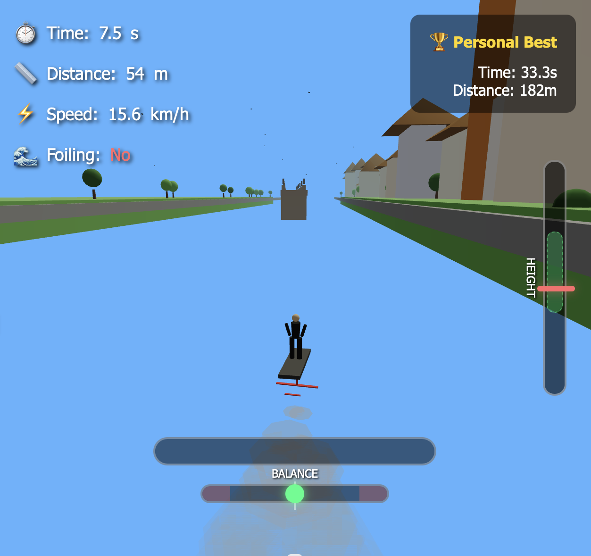

# 🏄 Pump Foil Würzburg - River Main Challenge

A 3D pump foiling game set on the River Main in Würzburg, Germany. Navigate past the iconic Festung Marienberg and Alte Mainbrücke while mastering the art of hydrofoil pumping!



## 🎮 Play Now

**[Play the game on GitHub Pages](https://yourusername.github.io/pumpfoil-wuerzburg/)**

## 🕹️ Controls

| Key | Action |
|-----|--------|
| **SPACE** | Hold to crouch/load the board, release to pump up |
| **← / A** | Steer left |
| **→ / D** | Steer right |

## 🎯 Gameplay Tips

1. **Master the Rhythm** - Pump at a steady rhythm (~0.8 seconds between pumps) for maximum efficiency
2. **Watch the Height Meter** - Stay in the green zone on the right side of the screen
3. **Maintain Speed** - If you slow down too much, you'll sink!
4. **Avoid Obstacles** - Dodge rowing boats, sports boats, and freight ships
5. **Don't Hit the Bridge** - The Alte Mainbrücke spans the river - stay above it or steer around!
6. **Return to Dock** - Bonus points for returning to the starting dock!

## 🏆 Scoring

- **Time on Water** - How long you stay foiling
- **Distance** - Total distance traveled
- **Dock Bonus** - Extra points for returning to the starting dock

Your personal best scores are saved locally in your browser.

## 🌆 Würzburg Landmarks Featured

- **Festung Marienberg** - The iconic hilltop fortress with its towers and vineyard terraces
- **Alte Mainbrücke** - The historic stone bridge with its 12 saint statues
- **Würzburg Cathedral (Dom)** - Visible twin towers in the city skyline
- **Old Town Buildings** - Colorful baroque architecture along the riverbank

## 🚀 Local Development

Simply open `index.html` in a modern web browser. No build process required!

For local server testing:
```bash
# Python 3
python -m http.server 8000

# Node.js
npx serve
```

Then visit `http://localhost:8000`

## 📁 Deployment to GitHub Pages

1. Fork or clone this repository
2. Go to repository Settings → Pages
3. Set Source to "Deploy from a branch"
4. Select `main` branch and `/ (root)` folder
5. Save and wait for deployment
6. Your game will be live at `https://yourusername.github.io/repository-name/`

## 🛠️ Technical Details

- **Engine**: Three.js (r160)
- **Physics**: Custom hydrofoil physics simulation
- **Features**:
  - Realistic water rendering with reflections
  - Dynamic sky with sun position
  - Procedural bird animations
  - Obstacle spawning system
  - Local high score storage

## 📝 License

MIT License - Feel free to modify and share!

## 🙏 Credits

- Built with [Three.js](https://threejs.org/)
- Water shader from Three.js examples
- Inspired by the beautiful city of Würzburg and the sport of pump foiling

---

*Made with ❤️ for the Würzburg AI community*
